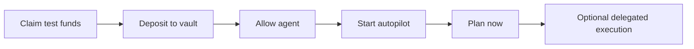

# Gardena Agent

Vault-native autopilot agent for Gardenaz on Mantle Sepolia.

The service plans around the delegated vault model:

1. user deposits funds into the vault
2. user allows the agent as vault operator
3. agent creates a decision
4. vault-native execution can open, rebalance, or close positions

## Important distinction

- Route names such as `Mantle RWA USDY Route` are display labels.
- On-chain autopilot policy uses the vault address as the protocol identity.
- Adapters and oracles live behind the vault route registry.

## Planner behavior

The autopilot planner now reasons about vault-native states:

- no vault cash -> explain deposit is required
- vault cash and no positions -> `open`
- active positions with better opportunity -> `rebalance`
- active position no longer policy-safe -> `close` back to vault cash
- blocked setup or policy -> `hold` or blocked explanation

## Execution model

- `open` -> `openPositionFor`
- `rebalance` -> `rebalancePosition`
- `close` -> `closePosition`

Decision logging is expected to happen through the vault during delegated execution.

## HTTP routes

- `POST /autopilot/plan`
- `POST /garden/plan`
- `POST /garden/chat`
- `GET /mcp/tools/list`
- `POST /mcp/tools/call`

## Product flow the app expects



## Environment

Use [agent/.env.example](/E:/web3/gardenaz/agent/.env.example) as the baseline.

The service now defaults to [mantle-sepolia.json](/E:/web3/gardenaz/agent/src/config/mantle-sepolia.json) if explicit env overrides are not provided.

Latest deployed addresses:

- `AgentIdentity`: `0x7d4cF8dAcCdc589d8601CB547d693c73dd5724e2`
- `DecisionLog`: `0x16E67F2Aaa40767FefeD0f2E1cF6bE87Ac3722Da`
- `AutopilotPolicy`: `0xd35fc1eb7BA3429f1B206FA6b054bbB71eCbD7e8`
- `GardenUsdMock`: `0x66cE4A644e004830887C3E8a44Fd5122B1edb28B`
- `GardenRwaMockVault`: `0x376368699aF13e6492b2A330e1d8e5D6560e38a8`
- `SteadyAdapter`: `0x23F83a27674E9776Ab663b10e3745DD682858f29`
- `GrowthAdapter`: `0x744F554EfEA9cE87E459E4a927Ba7F1fb85669c5`
- `BoostAdapter`: `0x9FD80B063C4d28fDbc592C7f4E4BA7F6f8166DEc`

## Development

```bash
npm install
npm run dev
```

## Verification

```bash
npm exec tsc --noEmit
npm exec tsx -- --test src/server.test.ts
npm exec tsx -- --test src/autopilot.test.ts
```
