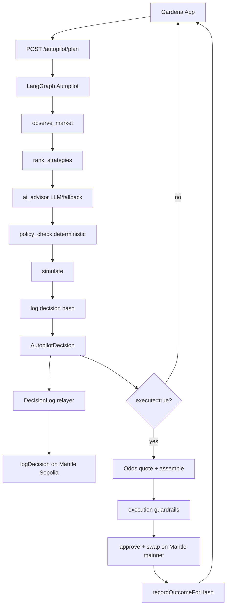
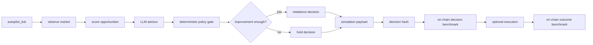

# Gardena Agent

Standalone LangGraph + HTTP agent service for **Gardena**, an AI x RWA yield garden on Mantle.

Current local path: `/root/projects/Gardenaz/agent`

Standalone repo: `Gardenaz/agent`

Gardena Agent receives user intent from Gardena App, maps crop choices to USDY/mETH strategy routes, runs an LLM advisory node inside a deterministic LangGraph workflow, gates every action through policy checks, optionally executes guarded Mantle RWA routes, and anchors decision + outcome benchmark records on-chain.

## Track fit

- Primary: **AI x RWA** — USDY, mETH, dynamic RWA strategy planning, bounded execution, and benchmarked outcomes.
- Secondary: **Consumer & Viral DApps** — crop labels, shareable harvest notes, readable agent diary payloads, transparent live feed.
- Supporting: **Agentic Wallets & Economy** — ERC-8004 identity, MCP-style tools, bounded relayer, reputation/validation context.

## Project boundary

This repo owns Agent concerns only:

- HTTP agent service.
- LangGraph orchestration.
- LLM advisory/rationale node.
- strategy planning.
- market opportunity scoring.
- autopilot tick decisions.
- deterministic policy checks.
- decision summary and decision hash generation.
- on-chain DecisionLog relayer.
- guarded Odos execution path on Mantle mainnet.
- MCP-style tool endpoints.
- outcome benchmark relay after execution.

It does not own:

- web UI — see `Gardenaz/app`.
- Solidity source/deployments — see `Gardenaz/contracts`.
- unrestricted custody of user funds.
- LLM-generated arbitrary calldata.
- Bybit/CEX API execution.

## Stack

- TypeScript
- Node HTTP server
- LangGraph: `@langchain/langgraph`
- LangChain core packages
- OpenAI-compatible chat completions for advisor node
- viem for hashing, relayer wallet, contract writes, approvals, raw tx relay
- Odos API for Mantle mainnet route quote + assembled calldata
- pino + pino-pretty for structured logs
- Node test runner via `tsx --test`

## Architecture



ASCII version:

```text
App intent
  ↓
HTTP agent service
  ↓
LangGraph autopilot:
  observe_market
    → rank_strategies
    → ai_advisor      # LLM or deterministic fallback
    → policy_check    # deterministic final gate
    → simulate
    → log decision hash
  ↓
DecisionLog.logDecision on Mantle Sepolia
  ↓
optional guarded Odos execution on Mantle mainnet
  ↓
DecisionLog.recordOutcomeForHash on Mantle Sepolia
  ↓
App proof + live transparency UI
```

## LangGraph status

Implemented.

- `src/graph.ts`
  - compiled manual decision graph.
  - nodes: plan, policy, log.
  - exposed through `createAgentGraph()` and `runAgent()`.
- `src/autopilot.ts`
  - compiled autopilot graph.
  - nodes: `observe_market`, `rank_strategies`, `ai_advisor`, `policy_check`, `simulate`, `log`.
  - exposed through `createAutopilotGraph()` and `runAutopilotTick()`.

LLM role:

- LLM only gives advisor context:
  - recommended strategy.
  - market summary.
  - risk notes.
  - confidence reason.
- LLM cannot execute tx.
- LLM cannot bypass deterministic policy.
- If `OPENAI_API_KEY` missing or API fails, agent uses deterministic fallback advisor.

## Strategy catalog

- `steady` → Rice / Safe Harvest
  - strategy: `steady-rwa-usdy`
  - asset: `USDY`
  - route: `Mantle RWA USDY Route`
  - risk: low
- `growth` → Corn / Growth Field
  - strategy: `growth-meth-yield`
  - asset: `mETH`
  - route: `Mantle mETH Yield Route`
  - risk: medium
- `boost` → Chili / Boost Farm
  - strategy: `boost-rwa-meth-dynamic`
  - asset: `USDY/mETH`
  - route: `Mantle Dynamic RWA Route`
  - risk: higher

## Autopilot flow



Scoring uses:

```text
score = expectedApy - riskPenalty - gasPenalty - liquidityPenalty + confidenceBonus
```

Policy safety checks:

- autopilot must be enabled.
- emergency pause must be inactive.
- amount must stay inside user max transaction amount.
- opportunity risk must be <= user max risk.
- protocol must be allowlisted.
- selected route must improve enough before rebalance.
- execution must be explicitly enabled.
- execution tx sending must be explicitly enabled.
- token must be allowlisted.
- chain must be Mantle mainnet for real asset route.
- slippage must stay <= configured max.
- notional must stay <= configured max.

## HTTP API

Run:

```bash
pnpm start
```

Health:

```bash
curl http://localhost:8787/health
```

Plan:

```bash
curl -X POST http://localhost:8787/autopilot/plan \
  -H 'content-type: application/json' \
  -d '{
    "user": "0x0000000000000000000000000000000000000001",
    "amount": "1000",
    "riskPreference": 1,
    "execute": false
  }'
```

Real execution request shape:

```json
{
  "user": "0x0000000000000000000000000000000000000001",
  "amount": "1000",
  "riskPreference": 1,
  "execute": true,
  "inputAsset": "USDY",
  "outputAsset": "mETH",
  "inputAmount": "1000000000000000000",
  "slippageBps": 100
}
```

## MCP-style tools

Current endpoints:

```text
GET  /mcp/tools/list
POST /mcp/tools/call
```

Tools:

- `plan_autopilot_strategy` — run policy-safe LangGraph plan.
- `quote_rwa_route` — get Odos quote for allowlisted route.
- `execute_rwa_route` — guarded approval + swap relay when enabled.
- `log_decision` — write decision proof to DecisionLog.

## On-chain integration

Mantle Sepolia deployment:

```text
AgentIdentity:       0xfAc7E0Ecb4BdFB5CabDf0A4A8f9930E547771271
DecisionLog:         0x4f38D23639a1E8644c64b262d2E4f09d22c5aC7c
RiskPolicy:          0x73132c590b323B37344d52C9adaDA2dA939896d3
ReputationRegistry:  0xC2a58107725a773A21102f575104b869dAfFCb4d
ValidationRegistry:  0x25863A08185bb82C7C363745702125800b4509da
AutopilotPolicy:     0xe04003396491954919a851fBbF90d87555cDdFEf
```

Decision proof:

```text
DecisionLog.logDecision(agentId, decisionHash, strategyId, targetProtocol, amount, riskLevel)
```

Outcome benchmark:

```text
DecisionLog.recordOutcomeForHash(decisionHash, executionTxHash, pnlBps, realizedApyBps, inputAmount, outputAmount, success, metadataURI)
```

## Execution modes

Default safe mode:

```text
EXECUTION_ENABLED=false
EXECUTION_SEND_TX=false
```

Modes:

```text
EXECUTION_ENABLED=false → disabled
EXECUTION_ENABLED=true, EXECUTION_SEND_TX=false → quote/calldata only
EXECUTION_ENABLED=true, EXECUTION_SEND_TX=true → approve + real swap tx
```

Mantle mainnet allowlist:

```text
USDY: 0x5Be26527E817998a7206475496f1C1F0bF4511C9
mETH: 0xcDA86A272531e8640cD7F1a92c01839911B90bb0
MNT:  0xDeadDeAddeAddEAddeadDEaDDEAdDeaDDeAD0000
chainId: 5000
```

## Environment

```bash
PORT=8787
LOG_LEVEL=info

OPENAI_API_KEY=
OPENAI_MODEL=gpt-4o-mini
OPENAI_BASE_URL=https://api.openai.com/v1/chat/completions

RELAYER_ENABLED=true
RELAYER_PRIVATE_KEY=
MANTLE_RPC_URL=https://rpc.sepolia.mantle.xyz
DECISION_LOG_ADDRESS=0x4f38D23639a1E8644c64b262d2E4f09d22c5aC7c
AGENT_URI=ipfs://bafkreica6vuhzakepbjntfjqhddmjh6vicpgcep2a657xfwtjkgb56kvxu

EXECUTION_ENABLED=false
EXECUTION_SEND_TX=false
MANTLE_MAINNET_RPC_URL=https://rpc.mantle.xyz
MAX_EXECUTION_USD=5
MAX_SLIPPAGE_BPS=100
```

Never commit `RELAYER_PRIVATE_KEY` or `OPENAI_API_KEY`.

## Key files

- `src/server.ts` — HTTP service and MCP-style endpoint router.
- `src/graph.ts` — manual LangGraph decision pipeline.
- `src/autopilot.ts` — autopilot yield optimizer graph with AI advisor node.
- `src/llm.ts` — OpenAI-compatible advisor client + deterministic fallback.
- `src/relayer.ts` — DecisionLog relayer, outcome benchmark relayer, raw tx relay, ERC20 approval relay.
- `src/execution/tokens.ts` — Mantle mainnet allowlist.
- `src/execution/odos.ts` — Odos quote/assemble integration.
- `src/execution/index.ts` — guarded execution orchestration.
- `src/config/mantle-sepolia.json` — current deployed contract addresses + ABIs.
- `src/config/deployment.ts` — deployment config loader.
- `src/logger.ts` — structured logs.
- `src/types.ts` — shared Agent and Autopilot types.
- `src/*.test.ts` — graph/autopilot/server test coverage.

## Development

```bash
pnpm install
pnpm test
pnpm typecheck
pnpm build
```

## Verification status

Expected green commands:

```bash
pnpm test
pnpm typecheck
pnpm build
```

Latest implemented scope:

- hosted agent API server.
- LangGraph manual graph.
- LangGraph autopilot graph.
- LLM advisor node with deterministic fallback.
- AI x RWA strategy metadata for USDY/mETH.
- consumer/share metadata in decision payloads.
- ERC-8004 registry context in autopilot decisions.
- on-chain DecisionLog decision proof.
- on-chain outcome benchmark proof.
- guarded Odos quote/execute path for Mantle mainnet.
- MCP-style tools.
- structured logs for demo observability.

Not implemented yet:

- production scheduler / recurring rebalance daemon.
- full MCP protocol server transport.
- protocol-specific vault/lending adapters beyond Odos route execution.
- real PnL oracle; current outcome fields are relayable benchmark fields, final calculation source still needs production oracle/indexer.
